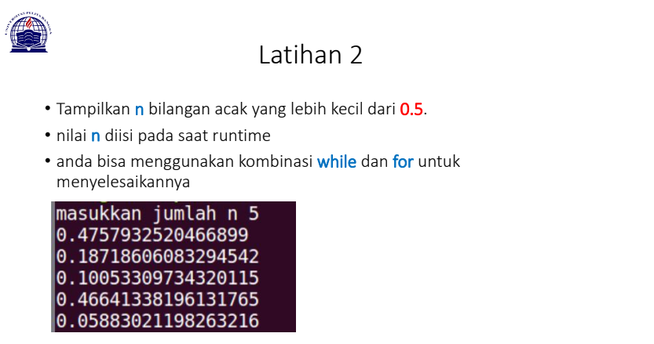
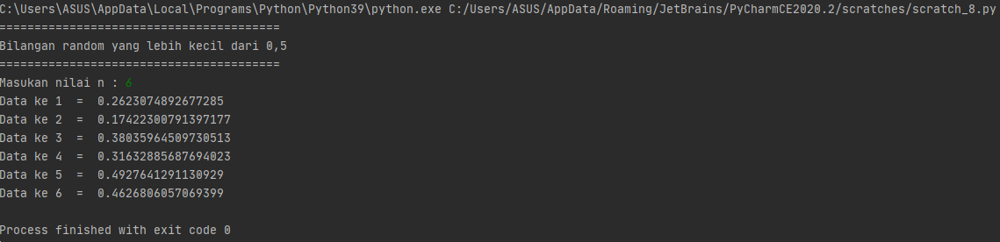

# Pertemuan7

**Nama  : RISKY HARIADI** <br>
**NIM   : 312010124** <br>
**Kelas : TI.20.A.1** <br>

# PPT ke 1
**labspy01**
 
**latihan 1** <br> 

**Jadi pada pertemuan ini saya diberikan beberapa tugas oleh dosen saya yaitu diantaranya:** <br>


**Pada tugas pertama, saya diminta untuk membuat sebuah program pengulangan bertingkat yang nantinya akan menghasilkan output seperti gambat diatas. Untuk bisa dapat menghasilkan output tersebut maka saya memasukan syntax:** <br>

``` python

baris = 10 
kolom = baris 

for bar in range(baris):
    for col in range(kolom): 
        tab = bar+col 
        print("{0:>5}".format(tab), end='')
    print()
``` 
**Mengapa demikian? Karena untuk dapat melakukan pengulangan bertingkat kamu perlu memasukan** <br>

``` python
for bar in range(baris):
    for col in range(kolom): 
        tab = bar+col 
        print("{0:>5}".format(tab), end='')
    print()
```
**dan karena pada syntax tersebut kamu membutuhkan baris dan kolom maka sebelum memasukan syntax diatas kamu perlu menambahkan keterangan baris dan kolom sesuai yang kalian butuhkan seperti ini.** <br>
``` python
baris = 10
kolom = baris
```
**Jika sudah memasukan semua syntax diatas dan telah di run, maka kamu akan mendapatkan tampilan seperti gambar yang ada dibawah ini** <br>


**Latihan 2**



**Di tugas ke dua, saya diminta untuk mencari nilai acak yang bernominal dibawah 0,5. Maka saya memasukan syntax:** <br>

``` python
import random
print(40*"=")
print("Bilangan random yang lebih kecil dari 0,5")
print(40*"=")
jum = int( input("Masukan nilai n : "))
i = 0
for i in range(jum):
    i += 1
    angkaDec = random.uniform(0, 0.5)
    print("Data ke", i, " = ", angkaDec)
```

**Syntax dibawah ini digunakan untuk mencari nilai random** <br>
``` python
import random
```
**Sementara untuk menentukan jumlah input yang diinginkan maka perlu memasukan** <br>
```
jum = int( input("Masukan nilai n : "))
```
**dan untuk menampilkan urutan data sesuai jumlah inputan dengan hasil di bawah 0.5 perlu memasukan** <br>
```
angkaDec = random.uniform(0, 0.5)
    print("Data ke", i, " = ", angkaDec)
```
**Jika sudah memasukan semua syntax diatas dan telah di run, maka kamu akan mendapatkan tampilan seperti gambar yang ada dibawah ini** <br>


### JANGAN LUPA UNTUK LIKE AND SUBSCRIBE

# TERIMAKASIH
